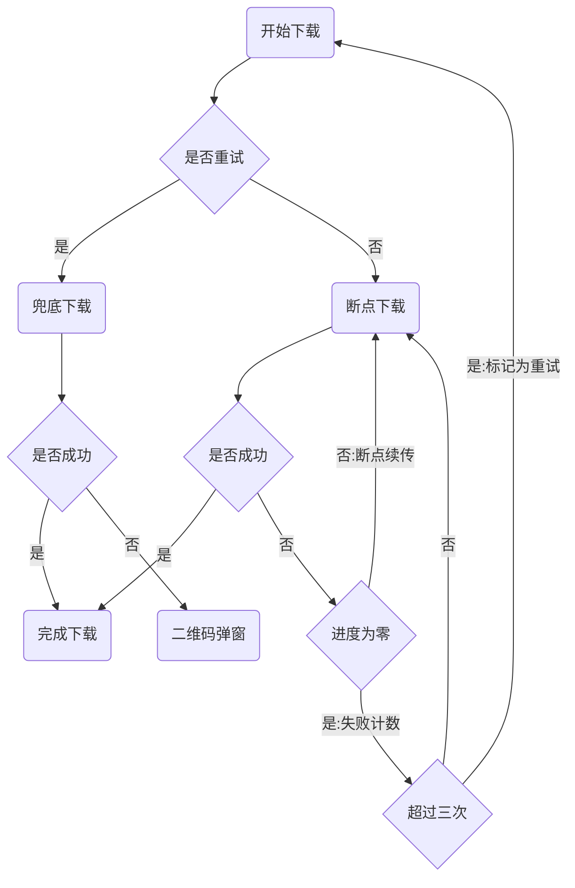
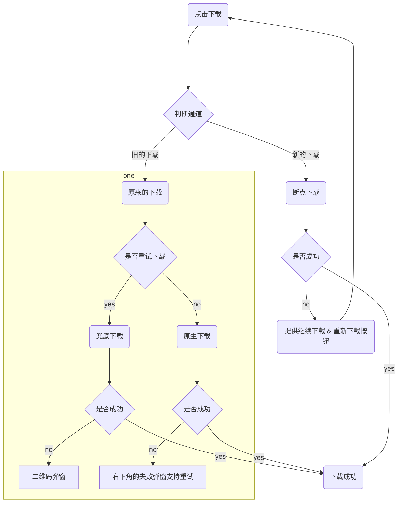
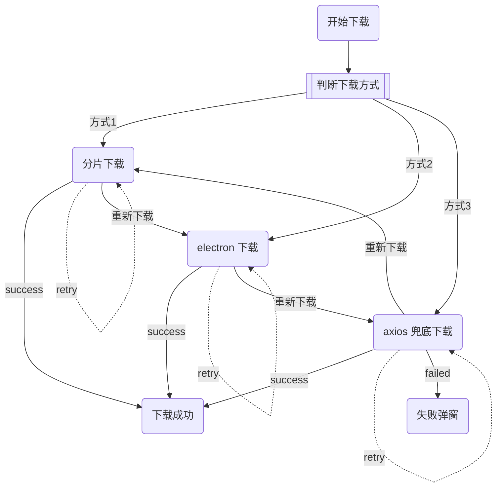

## 版本一

```mermaid
flowchart TB
A(开始下载)
B(断点下载)
C(兜底下载)
D(完成下载)
E(二维码弹窗)

F1{是否重试}
F2{是否成功}
F3{是否成功}
F4{进度为零}
F5{超过三次}

A --> F1 -- 是 --> C  --> F2 -- 是 --> D
F2 -- 否 --> E

F1 -- 否 --> B --> F3 -- 是 --> D
F3 -- 否 --> F4 -- 否:断点续传 --> B
F4 -- 是:失败计数 --> F5 -- 是:标记为重试 --> A
F5 -- 否 --> B

```

## 版本二

```mermaid
flowchart TB
A(点击下载)
B1(断点下载)
B2(原来的下载)
B21(原生下载)
B22(兜底下载)
C(下载成功)
D1(提供继续下载 & 重新下载按钮)


F1{判断通道}
F2{是否重试下载}
F3{是否成功}
F4{是否成功}
F5{是否成功}

A ----> F1

F1 -- 新的下载 --> B1 --> F3

F3 -- yes --> C
F3 -- no -->  D1 --> A

F1 -- 旧的下载 --> B2

subgraph one
B2 --> F2
F2 -- yes --> B22 --> F4 -- no --> 二维码弹窗
F2 -- no --> B21 --> F5 -- no --> 右下角的失败弹窗支持重试
end

F4 -- yes --> C
F5 -- yes --> C


```

## 版本三

```mermaid
flowchart TB

A(开始下载)

B[[判断下载方式]]

C1(分片下载)
C2(electron 下载)
C3(axios 兜底下载)

S(下载成功)
E(失败弹窗)

A --> B -- 方式1 --> C1
B -- 方式2 --> C2
B -- 方式3 --> C3

C1 -- success --> S
C1 -. retry .-> C1
C1 -- 重新下载 --> C2

C2 -- success --> S
C2 -. retry .-> C2
C2 -- 重新下载 --> C3


C3 -- success --> S
C3 -. retry .-> C3
C3 -- 重新下载 --> C1
C3 -- failed --> E

```
